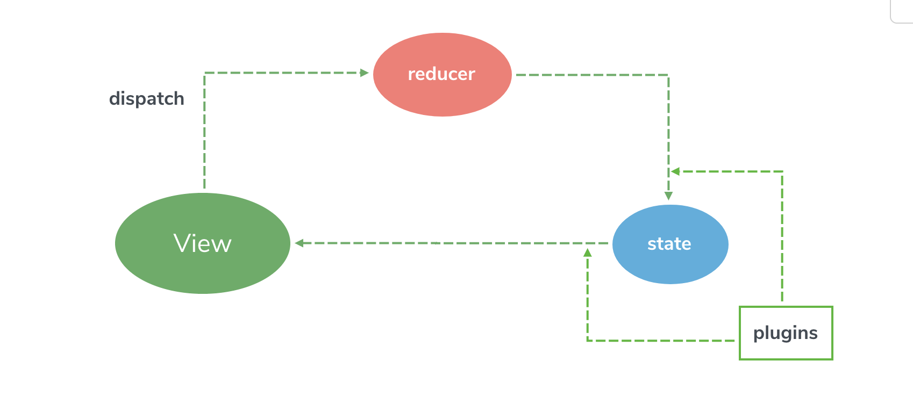

# Slim

[](https://www.npmjs.org/package/slim-store)
[](https://unpkg.com/slim-store/dist/slim.min.js)
[](https://packagephobia.now.sh/result?p=slim-store)
[](https://codecov.io/gh/victor0210/slim)
[](https://travis-ci.org/victor0210/slim)


Centralized State Management With Proxy, State-Non-Editable.



## Documentation

[English](https://victor0210.github.io/slimdocs/)

[中文文档](https://victor0210.github.io/slimdocs/zh/)

## Installation

### with script tag
1.0.0 is package version, get the newest version with [https://unpkg.com/slim-store](https://unpkg.com/slim-store)

```html
<script src="https://unpkg.com/slim-store@1.0.0/slim.min.js"></script> 
```

### with npm
```bash
npm install slim-store
```

## What is Slim
Slim is a Centralized State Manager with ES6 Proxy, which is **state-non-editable** and simple to use. There are only two modules you need to know.

* Reducer
* State

### Reducer
Reducer is state controller look like a simple event proxy. You can register reducer esay with

**ACTION\_TYPE** : **REDUCER\_FUNCTION**.

```
const reducers = {
	actionNameForDispatch: (state, ...args) => {}
}
```

you should and you must update state inside it. Update directly or return a new State are both allowed and the choice is yours.

### State
State is a Single Source Reponsitory for all state in Frontend, Backend, Local and so on, which allows all kinds of data what you wanna to control. update state only allowed by **Reducer**

## Why Slim

What is the difference between Slim and the more popular state management framework like Flux, Redux and Vuex?

### Smaller
All right! Just kidding. Next!

### State-Non-Editable

* Redux: state-editable
* Vuex: state-editable


You can't edit state anywhere out of reducer in Slim, which will make you more reassured that no one will modify the state in the business logic where you may not know. Where state change => Focus on reducer.

### Elastic

* Redux: update state by return a new state in reducer
* Vuex: update state in mutation

Slim is very elastic, it given two modes to control way of updating state in reducer

### Single Source
Slim provide a single-source state for the store, which only need parameter with a single-object. It's also can be registered in server side render

### Easy to be Integrated
Slim has the Plugin mechanism, which make you can integrate easily.

here is other state managers integrated by Slim:

* [VSlim: Vue State Management With Slim](https://victor0210.github.io/slimdocs/vslim.html)

## Examples

* [base counter](./tree/master/example/base)
* [vue counter](./tree/master/example/counter)
* [vue todomvc](./tree/master/example/todomvc)

running demo by blow scripts

```
# install dependencies
npm install

# run server
npm run demo
```

## Licence

[MIT](https://opensource.org/licenses/MIT)
