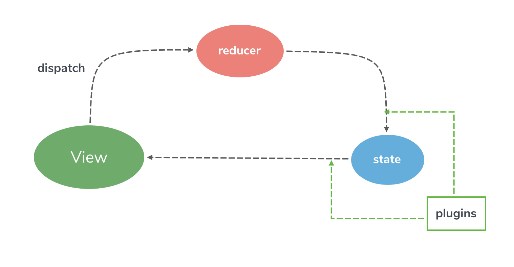

<p align="center">
    
</p>

<p align="center">
<a href="https://www.npmjs.org/package/slim-store">
    
</a>
<a href="https://unpkg.com/slim-store/dist/slim.min.js">
    
</a>
<a href="https://packagephobia.now.sh/result?p=slim-store">
    
</a>
<a href="https://codecov.io/gh/victor0210/slim">
    
</a>
<a href="https://travis-ci.org/victor0210/slim">
    
</a>
<a href="https://cypress.io">
    
</a>
<a>
    
</a>
</p>

<h1 align="center">Slim</h1>

<p align="center">Centralized State-Non-Editable State Management With Proxy.</p>

## Documentation

* [English](https://victor0210.github.io/slimdocs/)
* [中文文档](https://victor0210.github.io/slimdocs/zh/)

## QuickStart

* [VSlim: Vue State Management With Slim](https://victor0210.github.io/slimdocs/vslim.html)
* [RSlim: React State Management With Slim](https://victor0210.github.io/slimdocs/rslim.html)

## Pipeline

Blew picture just only explain how the state transfer.


## Installation

### Scripts Tag
Get the newest version

```html
<!-- slim -->
<script src="https://unpkg.com/slim-store@latest/slim.min.js"></script> 

<!-- vslim: slim in vue -->
<script src="https://unpkg.com/vslim@latest/vslim.min.js"></script> 

<!-- rslim: slim in react -->
<script src="https://unpkg.com/rslim@latest/rslim.min.js"></script> 
```

### NPM
```bash
# slim
npm install slim-store

# vslim
npm install vslim

# rslim
npm install rslim
```

## Examples

* Base
    * [counter](./tree/master/example/base)
* Vue
    * [counter](./tree/master/example/vue-counter)
    * [counter-maps](./tree/master/example/vue-maps)
    * [todomvc](./tree/master/example/vue-todomvc)
* React
    * [counter](./tree/master/example/react-counter)
    * [counter-computed](./tree/master/example/react-counter-computed)
    * [todomvc](./tree/master/example/react-todomvc)

```bash
# install dependencies
npm install

# run server
npm run demo
```
## Contributing

* [English](https://github.com/victor0210/slim/blob/master/CONTRIBUTING.md)
* [中文文档](https://github.com/victor0210/slim/blob/master/CONTRIBUTING-zh.md)

## Licence

[MIT](https://opensource.org/licenses/MIT)
